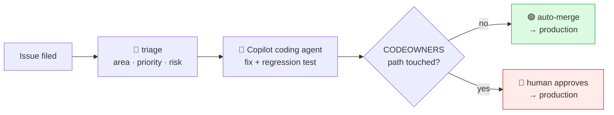

# Nimbus Store — an end-to-end Agentic SDLC demo

A working, resettable, 60-minute demo of the entire software delivery lifecycle
run by agents on GitHub — from *issue filed* to *deployed in production* —
where the decision about **who has to approve** is made by GitHub itself, from
the diff.

**[Live storefront](https://pakbaz.github.io/github-sdlc-e2e-demo/)** ·
**[Live pipeline board](https://pakbaz.github.io/github-sdlc-e2e-demo/#/pipeline)** ·
**[Policy](https://pakbaz.github.io/github-sdlc-e2e-demo/#/policy)**

---

## The idea

> **Priority decides how fast we care. Risk decides who has to say yes.**

Two of the seeded bugs in this repository are `priority/P0`. Both are genuinely
urgent.

| | Order total is off by a cent | Expired sessions are accepted |
|---|---|---|
| Priority | `P0` | `P0` |
| Risk | `low` | `high` |
| Code owner | none | `@pakbaz` |
| Outcome | **Ships itself in minutes. No human.** | **Blocked at the merge button.** |

The only difference is which directory the fix lands in. That is the demo.

## How it works



The gate is **not** a script. It is `.github/CODEOWNERS` plus a branch ruleset:

```
required_approving_review_count : 0
require_code_owner_review       : true
```

Together those mean: a pull request touching only unowned paths needs nobody; a
pull request touching an owned path cannot merge until its owner approves.
Deleting every workflow in this repository would not change that.

The agentic reviewer is declared with
`allowed-events: [COMMENT, REQUEST_CHANGES]`, so it is structurally incapable
of approving — two agents can never approve each other into production.

## Run it

```bash
gh repo clone pakbaz/github-sdlc-e2e-demo && cd github-sdlc-e2e-demo
npm ci

make setup     # idempotent: labels, ruleset, Pages, auto-merge, baseline tag
make doctor    # pre-flight — must print "Ready to demo"
make seed      # file the five scenario issues
make watch     # live pipeline state in the terminal
make reset     # back to a clean state, ready to run again
```

`make help` lists everything.

Then follow **[`demo/RUNBOOK.md`](demo/RUNBOOK.md)** — a minute-by-minute run of
show designed so the slow parts (an agent writing code takes 3–8 minutes)
happen while you are talking.

### Requirements

- `gh` ≥ 2.90 and the [`gh-aw`](https://github.com/githubnext/gh-aw) extension
- Node 22+
- A Copilot subscription with the coding agent enabled
- One fine-grained PAT stored as `COPILOT_GITHUB_TOKEN`, `GH_AW_GITHUB_TOKEN`
  and `DEMO_PAT` — `make setup` prints the exact permissions needed

## What is in here

| Path | |
|---|---|
| [`demo/RUNBOOK.md`](demo/RUNBOOK.md) | The 60-minute run of show |
| [`demo/POLICY.md`](demo/POLICY.md) | The risk/priority policy and why each area is where it is |
| [`demo/ARCHITECTURE.md`](demo/ARCHITECTURE.md) | Diagrams of the pipeline and why agentic workflows are read-only |
| [`.github/CODEOWNERS`](.github/CODEOWNERS) | The gate. The omissions matter as much as the entries. |
| `.github/workflows/triage.md` | Agentic triage — reads the issue, greps the code, labels it, explains itself |
| `.github/workflows/pr-review.md` | Agentic review — can comment and request changes, never approve |
| `.github/workflows/policy-gate.yml` | Independent path classification + the explainer comment |
| `src/features/dashboard/` | The live board that visualises this repository's own pipeline |
| `scripts/demo/` | `doctor` · `setup` · `seed` · `reset` · `status` |

## The planted defects

Every one is real, reproducible, and has a genuine fix.

| Scenario | File | Priority | Risk | Lane |
|---|---|---|---|---|
| Cart badge counts lines, not units | `src/features/ui/cart.ts` | `P3` | `low` | 🟢 auto |
| Float accumulation loses a cent | `src/features/checkout/total.ts` | `P0` | `low` | 🟢 auto |
| `isSessionValid` ignores `expiresAt` | `src/features/auth/session.ts` | `P0` | `high` | 🛑 gate |
| Public bucket, no TLS, no encryption | `infra/main.tf` | `P1` | `high` | 🛑 gate |
| No timeout, no retry, pagination drops pages | `src/features/api/client.ts` | `P1` | `medium` | 🛑 gate |

`main` is deliberately kept green: the unit tests assert only correct behaviour
and avoid the buggy cases, and each seeded issue asks the coding agent to add
the regression test that fails before its fix and passes after. That is what
makes CI genuinely go red → green on the pull request.

## Reusability

Everything the demo creates carries the `demo` label or lives on a `copilot/*`
branch, so `make reset` can be aggressive without touching anything else. Source
files are restored from the `demo-baseline` tag, which brings the planted
defects back exactly as they were.

Reset also runs from the Actions tab (**Demo · reset**), as does seeding
(**Demo · seed scenarios**), so the demo can be driven end to end from a phone.

## Development

```bash
make dev        # vite dev server
make verify     # lint · typecheck · unit · build
make e2e        # Playwright browser tests
make compile    # recompile agentic workflows after editing frontmatter
```

`.lock.yml` files are generated by `gh aw compile` and must be committed —
Actions runs the lock file, not the markdown.

---

*This is a demo repository. The Terraform is never applied, the storefront
takes no payments, and the defects are there on purpose.*
