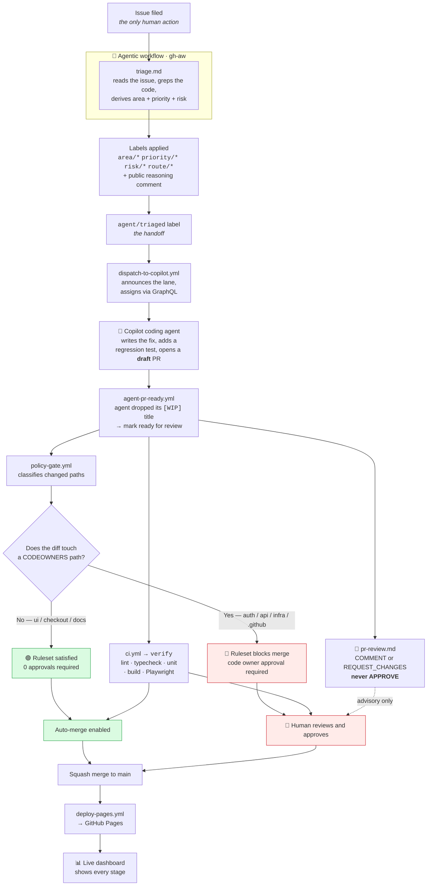
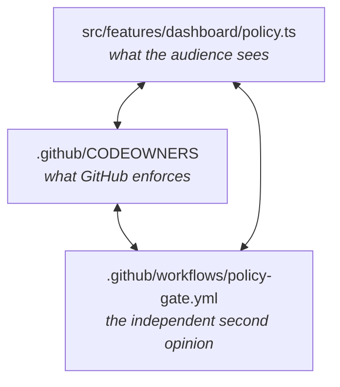

# Architecture

## The pipeline



## What runs where

| Workflow | Kind | Trigger | What it does |
|---|---|---|---|
| `triage.md` | agentic (`gh-aw`, Copilot) | issue opened | Reads the issue, greps the codebase, applies five labels, posts its reasoning |
| `dispatch-to-copilot.yml` | Actions | `agent/triaged` label | Comments which lane, assigns the issue to `copilot-swe-agent` via GraphQL |
| *(Copilot coding agent)* | GitHub-hosted | assignment | Writes the fix, adds a regression test, opens a **draft** pull request |
| `agent-pr-ready.yml` | Actions | PR edited · every 5 min | The agent leaves its finished pull request in draft, and a draft cannot auto-merge. Marks it ready once the `[WIP]` title is dropped. |
| `ci.yml` | Actions | pull request | `verify`: lint, typecheck, unit, build, Playwright. **Required check.** |
| `pr-review.md` | agentic (`gh-aw`, Copilot) | pull request | Reviews the diff; restricted to COMMENT / REQUEST_CHANGES |
| `policy-gate.yml` | Actions | pull request | Classifies paths, labels the PR, enables auto-merge *or* requests the code owner, posts the explainer |
| `deploy-pages.yml` | Actions | push to `main` | Builds and publishes to GitHub Pages |
| `demo-seed.yml` | Actions | manual | Files scenario issues from the Actions tab |
| `demo-reset.yml` | Actions | manual | Returns the repository to `demo-baseline` |

## How models are selected

The two `gh-aw` workflows declare:

```yaml
engine:
  id: copilot
  model: agent
```

`agent` is an adaptive alias rather than a pinned model ID. AWF token steering
and Copilot select from the models permitted by the repository's plan and
administrator policies, considering task complexity and current model
availability. A straightforward issue classification can use a faster model;
an ambiguous issue or complex pull-request review can receive stronger
reasoning without changing this repository.

`dispatch-to-copilot.yml` does not force a model when assigning the coding
agent. Copilot cloud agent therefore retains its Auto model selection. The
model used is visible in the agent response and workflow run, so the choice is
auditable even though it is not hard-coded.

## Why agentic workflows are read-only

`gh-aw` compiles each `.md` into a `.lock.yml` with a specific shape:

```mermaid
flowchart LR
  A["agent job<br/><code>permissions: read-all</code>"]
  -->|"structured JSON<br/>on stdout"|
  B["threat detection"]
  --> C["safe_outputs job<br/><i>has write permissions</i>"]
  --> D["labels · comments · reviews"]

  style A fill:#f6f8fa,stroke:#8c959f
  style C fill:#fff8c5,stroke:#bf8700
```

The model never holds a write token. It *requests* an operation; a separate job
with a narrow, declared permission set decides whether that request is
permitted. `add-labels` declares `allowed: [area/*, priority/*, risk/*,
route/*, agent/triaged]`, so a prompt-injected agent cannot invent a label —
let alone push code.

For the full breakdown — every frontmatter field, the seven compiled jobs, the
network firewall, the token subtleties and the gotchas — see
[`demo/AGENTIC-WORKFLOWS.md`](AGENTIC-WORKFLOWS.md).

## The three-way agreement

The routing table exists in three places, and they must stay in sync:



`CODEOWNERS` is authoritative — it is the one GitHub reads. The other two are
mirrors, and `doctor.sh` checks that the owned/unowned split still matches.
If they disagree, the disagreement is visible: the dashboard says one thing and
the merge button says another.

## The app

```
src/
  features/
    ui/         cart badge + storefront          ← planted defect · low risk
    checkout/   order totals                     ← planted defect · low risk
    auth/       session validation               ← planted defect · HIGH risk
    api/        shared HTTP client               ← planted defect · medium risk
    dashboard/  policy.ts · github.ts ·
                pipeline.ts · PipelinePage ·
                PolicyPage                       ← the live control tower
infra/main.tf   Terraform                        ← planted defect · HIGH risk
```

The dashboard reads this repository's own public REST API — issues, pull
requests, workflow runs, deployments — and maps each issue onto a seven-stage
board: **filed → triaged → agent working → PR open → human gate → merged →
deployed**. It refreshes every 20 seconds and degrades gracefully when the
anonymous rate limit (60/hour) runs out, with an optional token field.

The app watching its own delivery pipeline is not a gimmick: it means the
audience never has to context-switch to the GitHub UI to see what happened.
